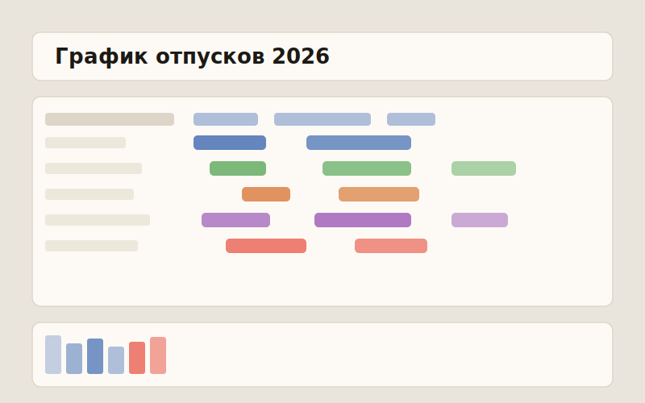

# 📅 Планировщик графика отпусков (ТК РФ)

**Однофайловое веб-приложение для составления графика отпусков сотрудников по российскому трудовому законодательству.**

## О проекте

Инструмент помогает кадровику или руководителю составить **график отпусков на год**: распределить части отпуска по сотрудникам, автоматически рассчитать даты выхода с учётом праздников, увидеть пересечения и «окна перегрузки», когда слишком много людей отдыхает одновременно.

Всё работает **в одном HTML-файле** — без сервера, без установки, без сборки. Данные хранятся локально в браузере (`localStorage`) и **никуда не отправляются**.

## ⚖️ Учитывает требования ТК РФ

- **Ст. 112 ТК РФ** — нерабочие праздничные дни внутри отпуска **не расходуют** дни отпуска, а **сдвигают** дату выхода. Выходные при этом отпуск не продлевают.
- **Ст. 125 ТК РФ** — деление отпуска на части допускается при условии, что **хотя бы одна часть ≥ 14 календарных дней**. Приложение подсвечивает нарушение.
- **Лимит нормы** (по умолчанию 28 дней) с предупреждением о превышении и о недопланировании.

## ✨ Возможности

- **Таблица сотрудников** — должность, до 8 частей отпуска, автоматический расчёт даты конца с пометкой сдвига на праздники.
- **Производственный календарь** — встроенные праздники на 2025–2026, обновление онлайн из [xmlcalendar/data](https://github.com/xmlcalendar/data) или ввод дат вручную.
- **Таймлайн года** — наглядные полосы отпусков, клик подсвечивает всех, кто пересекается; полоса «Одновременно» показывает плотность.
- **Окна перегрузки** — периоды, где одновременно отдыхает больше заданного порога, **с предупреждением о совпадении должностей** (например, два менеджера сразу).
- **Проверки нарушений** — превышение нормы, отсутствие части ≥ 14 дней, пересечение частей, дата вне года, недопланирование.
- **Мультигод** — отдельный график и праздники на каждый год, общий список сотрудников.
- **Импорт/экспорт** — резервная копия всего состояния в JSON (туда-обратно) и выгрузка в Excel (`.xlsx`).
- **Печать** — режим печати графика.
- **Масштаб** интерфейса и таймлайна под любой экран.

## 🚀 Как пользоваться

**Онлайн (живое демо):** откройте **[DonShefo.github.io/otpusk-planner-rf](https://DonShefo.github.io/otpusk-planner-rf/)**.

**Локально (HTML):**
1. Скачайте [`index.html`](https://DonShefo.github.io/otpusk-planner-rf/index.html) (или из раздела [Releases](../../releases)).
2. Откройте файл двойным кликом в любом современном браузере.
3. При первом открытии нужен интернет — библиотека React подгружается с CDN.

**Windows (портативный EXE, без браузера):**
1. Скачайте [`otpusk-planner-rf-portable-win64.zip`](../../releases/latest) из раздела Releases.
2. Распакуйте и запустите `grafik_otpuskov.exe` — это один самодостаточный файл, ничего ставить не нужно.
3. Нужен компонент *Microsoft Edge WebView2 Runtime* — на актуальных Windows 10/11 он уже есть; иначе ставится [бесплатно за минуту](https://developer.microsoft.com/microsoft-edge/webview2/).

> EXE собран из этой же актуальной версии `index.html` (Go + WebView2). Функциональность идентична HTML-версии.

> Данные примера обезличены: в комплекте один вымышленный сотрудник «Иванов Иван». Добавляйте своих через **«+ Добавить сотрудника»**.

## 🔒 Приватность

- Все данные хранятся только в вашем браузере (`localStorage`) и в файлах, которые вы сами экспортируете.
- Сетевые запросы — только два: загрузка React с CDN и (по кнопке) обновление праздников с GitHub. Никакой телеметрии.

## 🛠️ Технологии

Один HTML-файл: декларативный шаблон + класс-логика на ванильном JS, рендеринг через лёгкий React-рантайм (React 18 с CDN). Excel-экспорт собирается прямо в браузере (свой генератор `.xlsx` без зависимостей).

## 📄 Лицензия

[MIT](LICENSE) — используйте, изменяйте и распространяйте свободно.

---

Сделано для упрощения кадровой рутины. Issues и Pull Requests приветствуются.

